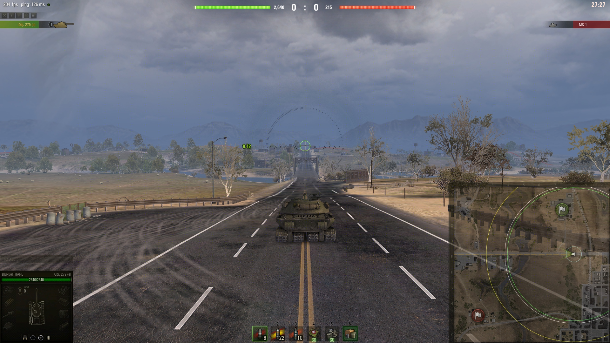
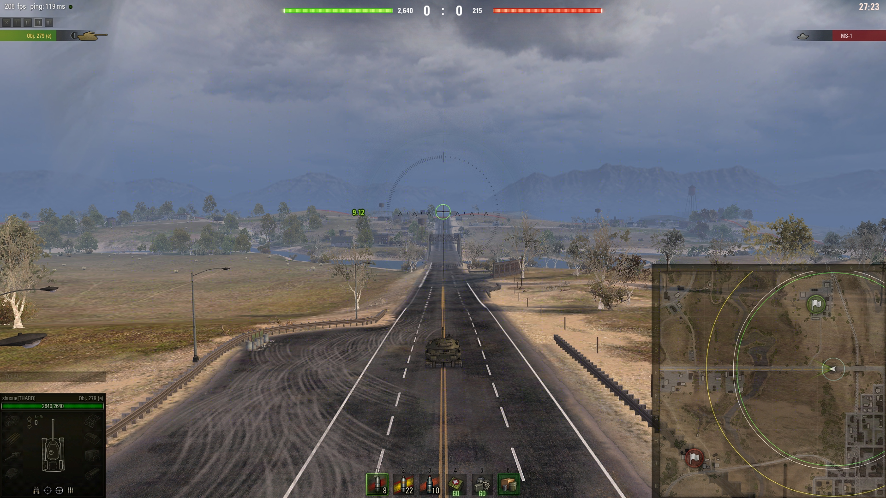
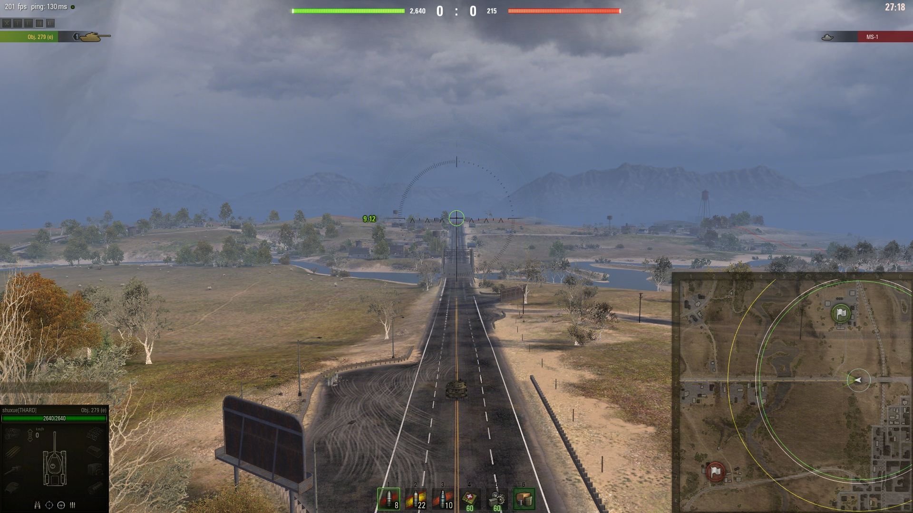
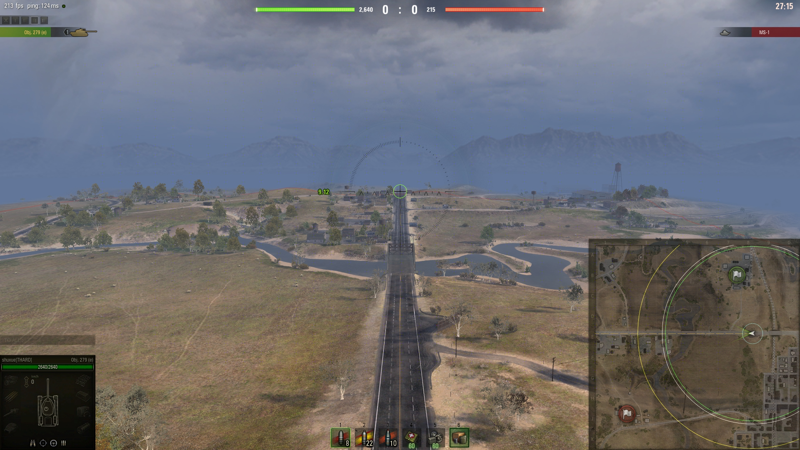
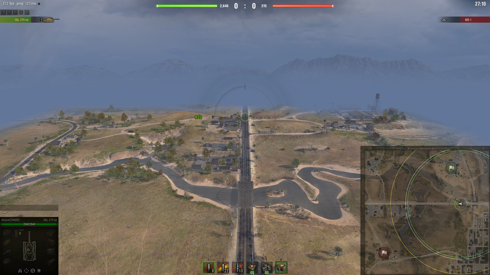

# Reworked Camera

	&bull; <a href="#en">EN</a> &bull; <a href="#ru">RU</a> 

## EN

Reworked the logic of camera work in battle

  

  

  

  

  

## RU

Переработана логика работы камеры в бою

  

  

  

  

  

