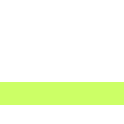

# Reworked Cap Circle

	&bull; <a href="#en">EN</a> &bull; <a href="#ru">RU</a> 

## EN

9 colors of capture circle

<table align="center">
  <tr>
    <td align="center"></td>
    <td align="center"></td>
    <td align="center"></td>
    <td align="center"></td>
	<td align="center"></td>
	<td align="center"></td>
	<td align="center"></td>
	<td align="center"></td>
	<td align="center"></td>
  </tr>
  <tr>
    <td align="center">Aqua</td>
    <td align="center">Black</td>
    <td align="center">GreenV1</td>
    <td align="center">GreenV2</td>
	<td align="center">Orange</td>
	<td align="center">Purple</td>
	<td align="center">Red</td>
	<td align="center">White</td>
	<td align="center">Yellow</td>
  </tr>
</table>

## RU

9 цветов круга захвата

<table align="center">
  <tr>
    <td align="center"></td>
    <td align="center"></td>
    <td align="center"></td>
    <td align="center"></td>
	<td align="center"></td>
	<td align="center"></td>
	<td align="center"></td>
	<td align="center"></td>
	<td align="center"></td>
  </tr>
  <tr>
    <td align="center">Aqua</td>
    <td align="center">Black</td>
    <td align="center">GreenV1</td>
    <td align="center">GreenV2</td>
	<td align="center">Orange</td>
	<td align="center">Purple</td>
	<td align="center">Red</td>
	<td align="center">White</td>
	<td align="center">Yellow</td>
  </tr>
</table>