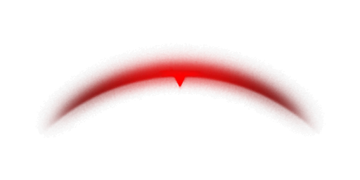
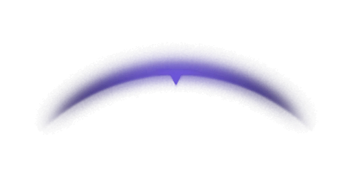

# Reworked Damage Indicator

	&bull; <a href="#en">EN</a> &bull; <a href="#ru">RU</a> 

## EN

Standard indicator is aligned

<table align="center">
  <tr>
    <td align="center"></td>
    <td align="center"></td>
    <td align="center"></td>
  </tr>
  <tr>
    <td align="center">Blocked</td>
    <td align="center">Damage</td>
    <td align="center">DamageBlind</td>
  </tr>
</table>

## RU

Стандартный индикатор выровнен

<table align="center">
  <tr>
    <td align="center"></td>
    <td align="center"></td>
    <td align="center"></td>
  </tr>
  <tr>
    <td align="center">Blocked</td>
    <td align="center">Damage</td>
    <td align="center">DamageBlind</td>
  </tr>
</table>