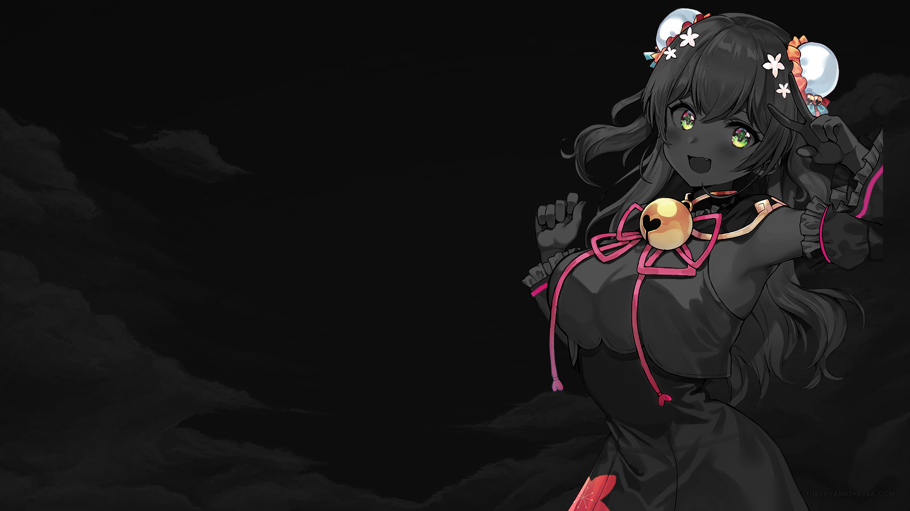

# Reworked Loading Game and Battle

	&bull; <a href="#en">EN</a> &bull; <a href="#ru">RU</a> 

## EN

**Not compatible with [Reworked Minimap](../reworkedminimap/) mod**  
**Minimap selection access inside the archive Reworked Loading Game and Battle**

Changed images when starting the game, entering the battle

Additionally third-party mods are used:
- [Scriptloader Pro](https://wgmods.net/323/) - Loading Game
- [Anime-Style Mod Collection - Vinyl Edition](https://wgmods.net/5827/) - Game exit image

Recommendations:
- Set in settings - display text when entering battle

<figure style="text-align: center;">
  <figcaption>Game launch: 1 of 65</figcaption>
  
</figure>

<figure style="text-align: center;">
  <figcaption>Entering battle: 1 of the maps in a random battle</figcaption>
  
</figure>

## RU

**Не совместим с модом [Reworked Minimap](../reworkedminimap/)**  
**Выбор миникарты доступ внутри архива Reworked Loading Game and Battle**

Изменены изображения при запуске игры, входе в бой

Дополнительно используются сторонние моды:
- [Scriptloader Pro](https://wgmods.net/323/) - Запуск игры
- [Anime-Style Mod Collection - Vinyl Edition](https://wgmods.net/5827/) - Изображение выхода из игры

Рекомендации:
- Установить в настройках - отображать текст при входе в бой

<figure style="text-align: center;">
  <figcaption>Запуск игры: 1 из 65</figcaption>
  
</figure>

<figure style="text-align: center;">
  <figcaption>Вход в бой: 1 из карт в случайном бою</figcaption>
  
</figure>
