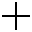

# Reworked Reticle

	&bull; <a href="#en">EN</a> &bull; <a href="#ru">RU</a> 

## EN

9 colors, 2 variants: one for the advanced damage indicator and one for the standard damage indicator

You can customize the reticle in the settings, as it was done on the vanilla client

  

### Arcade & Sniper 

<table align="center">
  <tr>
    <td colspan="15" align="center"><strong>Aqua</strong></td>
  </tr>
  <tr>
    <td align="center"></td>
    <td align="center"></td>
    <td align="center"></td>
    <td align="center"></td>
	<td align="center"></td>
	<td align="center"></td>
	<td align="center"></td>
	<td align="center"></td>
	<td align="center"></td>
	<td align="center"></td>
	<td align="center"></td>
	<td align="center"></td>
	<td align="center"></td>
	<td align="center"></td>
	<td align="center"></td>
  </tr>
  <tr>
    <td align="center">Line</td>
    <td align="center">Crosshair</td>
    <td align="center">Crosshair</td>
    <td align="center">Crosshair</td>
	<td align="center">Crosshair</td>
	<td align="center">Crosshair</td>
	<td align="center">Crosshair</td>
	<td align="center">Crosshair</td>
	<td align="center">Crosshair</td>
	<td align="center">Circle</td>
	<td align="center">Circle</td>
	<td align="center">Circle</td>
	<td align="center">Circle</td>
	<td align="center">Crosshair</td>
	<td align="center">Crosshair</td>
  </tr>
</table>

<table align="center">
  <tr>
    <td colspan="15" align="center"><strong>Black</strong></td>
  </tr>
  <tr>
    <td align="center"></td>
    <td align="center"></td>
    <td align="center"></td>
    <td align="center"></td>
	<td align="center"></td>
	<td align="center"></td>
	<td align="center"></td>
	<td align="center"></td>
	<td align="center"></td>
	<td align="center"></td>
	<td align="center"></td>
	<td align="center"></td>
	<td align="center"></td>
	<td align="center"></td>
	<td align="center"></td>
  </tr>
  <tr>
    <td align="center">Line</td>
    <td align="center">Crosshair</td>
    <td align="center">Crosshair</td>
    <td align="center">Crosshair</td>
	<td align="center">Crosshair</td>
	<td align="center">Crosshair</td>
	<td align="center">Crosshair</td>
	<td align="center">Crosshair</td>
	<td align="center">Crosshair</td>
	<td align="center">Circle</td>
	<td align="center">Circle</td>
	<td align="center">Circle</td>
	<td align="center">Circle</td>
	<td align="center">Crosshair</td>
	<td align="center">Crosshair</td>
  </tr>
</table>

<table align="center">
  <tr>
    <td colspan="15" align="center"><strong>GreenV1</strong></td>
  </tr>
  <tr>
    <td align="center"></td>
    <td align="center"></td>
    <td align="center"></td>
    <td align="center"></td>
	<td align="center"></td>
	<td align="center"></td>
	<td align="center"></td>
	<td align="center"></td>
	<td align="center"></td>
	<td align="center"></td>
	<td align="center"></td>
	<td align="center"></td>
	<td align="center"></td>
	<td align="center"></td>
	<td align="center"></td>
  </tr>
  <tr>
    <td align="center">Line</td>
    <td align="center">Crosshair</td>
    <td align="center">Crosshair</td>
    <td align="center">Crosshair</td>
	<td align="center">Crosshair</td>
	<td align="center">Crosshair</td>
	<td align="center">Crosshair</td>
	<td align="center">Crosshair</td>
	<td align="center">Crosshair</td>
	<td align="center">Circle</td>
	<td align="center">Circle</td>
	<td align="center">Circle</td>
	<td align="center">Circle</td>
	<td align="center">Crosshair</td>
	<td align="center">Crosshair</td>
  </tr>
</table>

<table align="center">
  <tr>
    <td colspan="15" align="center"><strong>GreenV2</strong></td>
  </tr>
  <tr>
    <td align="center"></td>
    <td align="center"></td>
    <td align="center"></td>
    <td align="center"></td>
	<td align="center"></td>
	<td align="center"></td>
	<td align="center"></td>
	<td align="center"></td>
	<td align="center"></td>
	<td align="center"></td>
	<td align="center"></td>
	<td align="center"></td>
	<td align="center"></td>
	<td align="center"></td>
	<td align="center"></td>
  </tr>
  <tr>
    <td align="center">Line</td>
    <td align="center">Crosshair</td>
    <td align="center">Crosshair</td>
    <td align="center">Crosshair</td>
	<td align="center">Crosshair</td>
	<td align="center">Crosshair</td>
	<td align="center">Crosshair</td>
	<td align="center">Crosshair</td>
	<td align="center">Crosshair</td>
	<td align="center">Circle</td>
	<td align="center">Circle</td>
	<td align="center">Circle</td>
	<td align="center">Circle</td>
	<td align="center">Crosshair</td>
	<td align="center">Crosshair</td>
  </tr>
</table>

<table align="center">
  <tr>
    <td colspan="15" align="center"><strong>Orange</strong></td>
  </tr>
  <tr>
    <td align="center"></td>
    <td align="center"></td>
    <td align="center"></td>
    <td align="center"></td>
	<td align="center"></td>
	<td align="center"></td>
	<td align="center"></td>
	<td align="center"></td>
	<td align="center"></td>
	<td align="center"></td>
	<td align="center"></td>
	<td align="center"></td>
	<td align="center"></td>
	<td align="center"></td>
	<td align="center"></td>
  </tr>
  <tr>
    <td align="center">Line</td>
    <td align="center">Crosshair</td>
    <td align="center">Crosshair</td>
    <td align="center">Crosshair</td>
	<td align="center">Crosshair</td>
	<td align="center">Crosshair</td>
	<td align="center">Crosshair</td>
	<td align="center">Crosshair</td>
	<td align="center">Crosshair</td>
	<td align="center">Circle</td>
	<td align="center">Circle</td>
	<td align="center">Circle</td>
	<td align="center">Circle</td>
	<td align="center">Crosshair</td>
	<td align="center">Crosshair</td>
  </tr>
</table>

<table align="center">
  <tr>
    <td colspan="15" align="center"><strong>Purple</strong></td>
  </tr>
  <tr>
    <td align="center"></td>
    <td align="center"></td>
    <td align="center"></td>
    <td align="center"></td>
	<td align="center"></td>
	<td align="center"></td>
	<td align="center"></td>
	<td align="center"></td>
	<td align="center"></td>
	<td align="center"></td>
	<td align="center"></td>
	<td align="center"></td>
	<td align="center"></td>
	<td align="center"></td>
	<td align="center"></td>
  </tr>
  <tr>
    <td align="center">Line</td>
    <td align="center">Crosshair</td>
    <td align="center">Crosshair</td>
    <td align="center">Crosshair</td>
	<td align="center">Crosshair</td>
	<td align="center">Crosshair</td>
	<td align="center">Crosshair</td>
	<td align="center">Crosshair</td>
	<td align="center">Crosshair</td>
	<td align="center">Circle</td>
	<td align="center">Circle</td>
	<td align="center">Circle</td>
	<td align="center">Circle</td>
	<td align="center">Crosshair</td>
	<td align="center">Crosshair</td>
  </tr>
</table>

<table align="center">
  <tr>
    <td colspan="15" align="center"><strong>Red</strong></td>
  </tr>
  <tr>
    <td align="center"></td>
    <td align="center"></td>
    <td align="center"></td>
    <td align="center"></td>
	<td align="center"></td>
	<td align="center"></td>
	<td align="center"></td>
	<td align="center"></td>
	<td align="center"></td>
	<td align="center"></td>
	<td align="center"></td>
	<td align="center"></td>
	<td align="center"></td>
	<td align="center"></td>
	<td align="center"></td>
  </tr>
  <tr>
    <td align="center">Line</td>
    <td align="center">Crosshair</td>
    <td align="center">Crosshair</td>
    <td align="center">Crosshair</td>
	<td align="center">Crosshair</td>
	<td align="center">Crosshair</td>
	<td align="center">Crosshair</td>
	<td align="center">Crosshair</td>
	<td align="center">Crosshair</td>
	<td align="center">Circle</td>
	<td align="center">Circle</td>
	<td align="center">Circle</td>
	<td align="center">Circle</td>
	<td align="center">Crosshair</td>
	<td align="center">Crosshair</td>
  </tr>
</table>

<table align="center">
  <tr>
    <td colspan="15" align="center"><strong>White</strong></td>
  </tr>
  <tr>
    <td align="center"></td>
    <td align="center"></td>
    <td align="center"></td>
    <td align="center"></td>
	<td align="center"></td>
	<td align="center"></td>
	<td align="center"></td>
	<td align="center"></td>
	<td align="center"></td>
	<td align="center"></td>
	<td align="center"></td>
	<td align="center"></td>
	<td align="center"></td>
	<td align="center"></td>
	<td align="center"></td>
  </tr>
  <tr>
    <td align="center">Line</td>
    <td align="center">Crosshair</td>
    <td align="center">Crosshair</td>
    <td align="center">Crosshair</td>
	<td align="center">Crosshair</td>
	<td align="center">Crosshair</td>
	<td align="center">Crosshair</td>
	<td align="center">Crosshair</td>
	<td align="center">Crosshair</td>
	<td align="center">Circle</td>
	<td align="center">Circle</td>
	<td align="center">Circle</td>
	<td align="center">Circle</td>
	<td align="center">Crosshair</td>
	<td align="center">Crosshair</td>
  </tr>
</table>

<table align="center">
  <tr>
    <td colspan="15" align="center"><strong>Yellow</strong></td>
  </tr>
  <tr>
    <td align="center"></td>
    <td align="center"></td>
    <td align="center"></td>
    <td align="center"></td>
	<td align="center"></td>
	<td align="center"></td>
	<td align="center"></td>
	<td align="center"></td>
	<td align="center"></td>
	<td align="center"></td>
	<td align="center"></td>
	<td align="center"></td>
	<td align="center"></td>
	<td align="center"></td>
	<td align="center"></td>
  </tr>
  <tr>
    <td align="center">Line</td>
    <td align="center">Crosshair</td>
    <td align="center">Crosshair</td>
    <td align="center">Crosshair</td>
	<td align="center">Crosshair</td>
	<td align="center">Crosshair</td>
	<td align="center">Crosshair</td>
	<td align="center">Crosshair</td>
	<td align="center">Crosshair</td>
	<td align="center">Circle</td>
	<td align="center">Circle</td>
	<td align="center">Circle</td>
	<td align="center">Circle</td>
	<td align="center">Crosshair</td>
	<td align="center">Crosshair</td>
  </tr>
</table>

### Strategic & Assault | Postmortem without "Line"

<table align="center">
  <tr>
    <td colspan="15" align="center"><strong>Aqua</strong></td>
  </tr>
  <tr>
    <td align="center"></td>
    <td align="center"></td>
  </tr>
  <tr>
    <td align="center">Line</td>
    <td align="center">Crosshair</td>
  </tr>
</table>

<table align="center">
  <tr>
    <td colspan="15" align="center"><strong>Black</strong></td>
  </tr>
  <tr>
    <td align="center"></td>
    <td align="center"></td>
  </tr>
  <tr>
    <td align="center">Line</td>
    <td align="center">Crosshair</td>
  </tr>
</table>

<table align="center">
  <tr>
    <td colspan="15" align="center"><strong>GreenV1</strong></td>
  </tr>
  <tr>
    <td align="center"></td>
    <td align="center"></td>
  </tr>
  <tr>
    <td align="center">Line</td>
    <td align="center">Crosshair</td>
  </tr>
</table>

<table align="center">
  <tr>
    <td colspan="15" align="center"><strong>GreenV2</strong></td>
  </tr>
  <tr>
    <td align="center"></td>
    <td align="center"></td>
  </tr>
  <tr>
    <td align="center">Line</td>
    <td align="center">Crosshair</td>
  </tr>
</table>

<table align="center">
  <tr>
    <td colspan="15" align="center"><strong>Orange</strong></td>
  </tr>
  <tr>
    <td align="center"></td>
    <td align="center"></td>
  </tr>
  <tr>
    <td align="center">Line</td>
    <td align="center">Crosshair</td>
  </tr>
</table>

<table align="center">
  <tr>
    <td colspan="15" align="center"><strong>Purple</strong></td>
  </tr>
  <tr>
    <td align="center"></td>
    <td align="center"></td>
  </tr>
  <tr>
    <td align="center">Line</td>
    <td align="center">Crosshair</td>
  </tr>
</table>

<table align="center">
  <tr>
    <td colspan="15" align="center"><strong>Red</strong></td>
  </tr>
  <tr>
    <td align="center"></td>
    <td align="center"></td>
  </tr>
  <tr>
    <td align="center">Line</td>
    <td align="center">Crosshair</td>
  </tr>
</table>

<table align="center">
  <tr>
    <td colspan="15" align="center"><strong>White</strong></td>
  </tr>
  <tr>
    <td align="center"></td>
    <td align="center"></td>
  </tr>
  <tr>
    <td align="center">Line</td>
    <td align="center">Crosshair</td>
  </tr>
</table>

<table align="center">
  <tr>
    <td colspan="15" align="center"><strong>Yellow</strong></td>
  </tr>
  <tr>
    <td align="center"></td>
    <td align="center"></td>
  </tr>
  <tr>
    <td align="center">Line</td>
    <td align="center">Crosshair</td>
  </tr>
</table>

### Controls (penetration)

<table align="center">
  <tr>
    <td colspan="15" align="center"><strong>Set 1</strong></td>
  </tr>
  <tr>
    <td align="center"></td>
    <td align="center"></td>
    <td align="center"></td>
    <td align="center"></td>
	<td align="center"></td>
	<td align="center"></td>
  </tr>
  <tr>
    <td align="center">Crosshair</td>
    <td align="center">Crosshair</td>
    <td align="center">Crosshair</td>
    <td align="center">Crosshair</td>
	<td align="center">Crosshair</td>
	<td align="center">Crosshair</td>
  </tr>
</table>

<table align="center">
  <tr>
    <td colspan="15" align="center"><strong>Set 2</strong></td>
  </tr>
  <tr>
    <td align="center"></td>
    <td align="center"></td>
    <td align="center"></td>
    <td align="center"></td>
	<td align="center"></td>
	<td align="center"></td>
  </tr>
  <tr>
    <td align="center">Crosshair</td>
    <td align="center">Crosshair</td>
    <td align="center">Crosshair</td>
    <td align="center">Crosshair</td>
	<td align="center">Crosshair</td>
	<td align="center">Crosshair</td>
  </tr>
</table>

<table align="center">
  <tr>
    <td colspan="15" align="center"><strong>Set 3</strong></td>
  </tr>
  <tr>
    <td align="center"></td>
    <td align="center"></td>
    <td align="center"></td>
    <td align="center"></td>
	<td align="center"></td>
  </tr>
  <tr>
    <td align="center">Crosshair</td>
    <td align="center">Crosshair</td>
    <td align="center">Crosshair</td>
    <td align="center">Crosshair</td>
	<td align="center">Crosshair</td>
  </tr>
</table>

<table align="center">
  <tr>
    <td colspan="15" align="center"><strong>Set 4</strong></td>
  </tr>
  <tr>
    <td align="center"></td>
    <td align="center"></td>
    <td align="center"></td>
    <td align="center"></td>
	<td align="center"></td>
  </tr>
  <tr>
    <td align="center">Crosshair</td>
    <td align="center">Crosshair</td>
    <td align="center">Crosshair</td>
    <td align="center">Crosshair</td>
	<td align="center">Crosshair</td>
  </tr>
</table>

<table align="center">
  <tr>
    <td colspan="15" align="center"><strong>Set 5</strong></td>
  </tr>
  <tr>
    <td align="center"></td>
    <td align="center"></td>
    <td align="center"></td>
    <td align="center"></td>
	<td align="center"></td>
  </tr>
  <tr>
    <td align="center">Crosshair</td>
    <td align="center">Crosshair</td>
    <td align="center">Crosshair</td>
    <td align="center">Crosshair</td>
	<td align="center">Crosshair</td>
  </tr>
</table>

<table align="center">
  <tr>
    <td colspan="15" align="center"><strong>Set 6</strong></td>
  </tr>
  <tr>
    <td align="center"></td>
    <td align="center"></td>
    <td align="center"></td>
    <td align="center"></td>
	<td align="center"></td>
  </tr>
  <tr>
    <td align="center">Crosshair</td>
    <td align="center">Crosshair</td>
    <td align="center">Crosshair</td>
    <td align="center">Crosshair</td>
	<td align="center">Crosshair</td>
  </tr>
</table>

## RU

9 цветов, 2 варианта: один для расширенного индикатора урона и один для стандартного индикатора урона

Настроить прицел можно в настройках, как это делалось на ванильном клиенте

  

### Аркадный & Снайперский

<table align="center">
  <tr>
    <td colspan="15" align="center"><strong>Aqua</strong></td>
  </tr>
  <tr>
    <td align="center"></td>
    <td align="center"></td>
    <td align="center"></td>
    <td align="center"></td>
	<td align="center"></td>
	<td align="center"></td>
	<td align="center"></td>
	<td align="center"></td>
	<td align="center"></td>
	<td align="center"></td>
	<td align="center"></td>
	<td align="center"></td>
	<td align="center"></td>
	<td align="center"></td>
	<td align="center"></td>
  </tr>
  <tr>
    <td align="center">Линия</td>
    <td align="center">Перекрестие</td>
    <td align="center">Перекрестие</td>
    <td align="center">Перекрестие</td>
	<td align="center">Перекрестие</td>
	<td align="center">Перекрестие</td>
	<td align="center">Перекрестие</td>
	<td align="center">Перекрестие</td>
	<td align="center">Перекрестие</td>
	<td align="center">Круг</td>
	<td align="center">Круг</td>
	<td align="center">Круг</td>
	<td align="center">Круг</td>
	<td align="center">Перекрестие</td>
	<td align="center">Перекрестие</td>
  </tr>
</table>

<table align="center">
  <tr>
    <td colspan="15" align="center"><strong>Black</strong></td>
  </tr>
  <tr>
    <td align="center"></td>
    <td align="center"></td>
    <td align="center"></td>
    <td align="center"></td>
	<td align="center"></td>
	<td align="center"></td>
	<td align="center"></td>
	<td align="center"></td>
	<td align="center"></td>
	<td align="center"></td>
	<td align="center"></td>
	<td align="center"></td>
	<td align="center"></td>
	<td align="center"></td>
	<td align="center"></td>
  </tr>
  <tr>
    <td align="center">Линия</td>
    <td align="center">Перекрестие</td>
    <td align="center">Перекрестие</td>
    <td align="center">Перекрестие</td>
	<td align="center">Перекрестие</td>
	<td align="center">Перекрестие</td>
	<td align="center">Перекрестие</td>
	<td align="center">Перекрестие</td>
	<td align="center">Перекрестие</td>
	<td align="center">Круг</td>
	<td align="center">Круг</td>
	<td align="center">Круг</td>
	<td align="center">Круг</td>
	<td align="center">Перекрестие</td>
	<td align="center">Перекрестие</td>
  </tr>
</table>

<table align="center">
  <tr>
    <td colspan="15" align="center"><strong>GreenV1</strong></td>
  </tr>
  <tr>
    <td align="center"></td>
    <td align="center"></td>
    <td align="center"></td>
    <td align="center"></td>
	<td align="center"></td>
	<td align="center"></td>
	<td align="center"></td>
	<td align="center"></td>
	<td align="center"></td>
	<td align="center"></td>
	<td align="center"></td>
	<td align="center"></td>
	<td align="center"></td>
	<td align="center"></td>
	<td align="center"></td>
  </tr>
  <tr>
    <td align="center">Линия</td>
    <td align="center">Перекрестие</td>
    <td align="center">Перекрестие</td>
    <td align="center">Перекрестие</td>
	<td align="center">Перекрестие</td>
	<td align="center">Перекрестие</td>
	<td align="center">Перекрестие</td>
	<td align="center">Перекрестие</td>
	<td align="center">Перекрестие</td>
	<td align="center">Круг</td>
	<td align="center">Круг</td>
	<td align="center">Круг</td>
	<td align="center">Круг</td>
	<td align="center">Перекрестие</td>
	<td align="center">Перекрестие</td>
  </tr>
</table>

<table align="center">
  <tr>
    <td colspan="15" align="center"><strong>GreenV2</strong></td>
  </tr>
  <tr>
    <td align="center"></td>
    <td align="center"></td>
    <td align="center"></td>
    <td align="center"></td>
	<td align="center"></td>
	<td align="center"></td>
	<td align="center"></td>
	<td align="center"></td>
	<td align="center"></td>
	<td align="center"></td>
	<td align="center"></td>
	<td align="center"></td>
	<td align="center"></td>
	<td align="center"></td>
	<td align="center"></td>
  </tr>
  <tr>
    <td align="center">Линия</td>
    <td align="center">Перекрестие</td>
    <td align="center">Перекрестие</td>
    <td align="center">Перекрестие</td>
	<td align="center">Перекрестие</td>
	<td align="center">Перекрестие</td>
	<td align="center">Перекрестие</td>
	<td align="center">Перекрестие</td>
	<td align="center">Перекрестие</td>
	<td align="center">Круг</td>
	<td align="center">Круг</td>
	<td align="center">Круг</td>
	<td align="center">Круг</td>
	<td align="center">Перекрестие</td>
	<td align="center">Перекрестие</td>
  </tr>
</table>

<table align="center">
  <tr>
    <td colspan="15" align="center"><strong>Orange</strong></td>
  </tr>
  <tr>
    <td align="center"></td>
    <td align="center"></td>
    <td align="center"></td>
    <td align="center"></td>
	<td align="center"></td>
	<td align="center"></td>
	<td align="center"></td>
	<td align="center"></td>
	<td align="center"></td>
	<td align="center"></td>
	<td align="center"></td>
	<td align="center"></td>
	<td align="center"></td>
	<td align="center"></td>
	<td align="center"></td>
  </tr>
  <tr>
    <td align="center">Линия</td>
    <td align="center">Перекрестие</td>
    <td align="center">Перекрестие</td>
    <td align="center">Перекрестие</td>
	<td align="center">Перекрестие</td>
	<td align="center">Перекрестие</td>
	<td align="center">Перекрестие</td>
	<td align="center">Перекрестие</td>
	<td align="center">Перекрестие</td>
	<td align="center">Круг</td>
	<td align="center">Круг</td>
	<td align="center">Круг</td>
	<td align="center">Круг</td>
	<td align="center">Перекрестие</td>
	<td align="center">Перекрестие</td>
  </tr>
</table>

<table align="center">
  <tr>
    <td colspan="15" align="center"><strong>Purple</strong></td>
  </tr>
  <tr>
    <td align="center"></td>
    <td align="center"></td>
    <td align="center"></td>
    <td align="center"></td>
	<td align="center"></td>
	<td align="center"></td>
	<td align="center"></td>
	<td align="center"></td>
	<td align="center"></td>
	<td align="center"></td>
	<td align="center"></td>
	<td align="center"></td>
	<td align="center"></td>
	<td align="center"></td>
	<td align="center"></td>
  </tr>
  <tr>
    <td align="center">Линия</td>
    <td align="center">Перекрестие</td>
    <td align="center">Перекрестие</td>
    <td align="center">Перекрестие</td>
	<td align="center">Перекрестие</td>
	<td align="center">Перекрестие</td>
	<td align="center">Перекрестие</td>
	<td align="center">Перекрестие</td>
	<td align="center">Перекрестие</td>
	<td align="center">Круг</td>
	<td align="center">Круг</td>
	<td align="center">Круг</td>
	<td align="center">Круг</td>
	<td align="center">Перекрестие</td>
	<td align="center">Перекрестие</td>
  </tr>
</table>

<table align="center">
  <tr>
    <td colspan="15" align="center"><strong>Red</strong></td>
  </tr>
  <tr>
    <td align="center"></td>
    <td align="center"></td>
    <td align="center"></td>
    <td align="center"></td>
	<td align="center"></td>
	<td align="center"></td>
	<td align="center"></td>
	<td align="center"></td>
	<td align="center"></td>
	<td align="center"></td>
	<td align="center"></td>
	<td align="center"></td>
	<td align="center"></td>
	<td align="center"></td>
	<td align="center"></td>
  </tr>
  <tr>
    <td align="center">Линия</td>
    <td align="center">Перекрестие</td>
    <td align="center">Перекрестие</td>
    <td align="center">Перекрестие</td>
	<td align="center">Перекрестие</td>
	<td align="center">Перекрестие</td>
	<td align="center">Перекрестие</td>
	<td align="center">Перекрестие</td>
	<td align="center">Перекрестие</td>
	<td align="center">Круг</td>
	<td align="center">Круг</td>
	<td align="center">Круг</td>
	<td align="center">Круг</td>
	<td align="center">Перекрестие</td>
	<td align="center">Перекрестие</td>
  </tr>
</table>

<table align="center">
  <tr>
    <td colspan="15" align="center"><strong>White</strong></td>
  </tr>
  <tr>
    <td align="center"></td>
    <td align="center"></td>
    <td align="center"></td>
    <td align="center"></td>
	<td align="center"></td>
	<td align="center"></td>
	<td align="center"></td>
	<td align="center"></td>
	<td align="center"></td>
	<td align="center"></td>
	<td align="center"></td>
	<td align="center"></td>
	<td align="center"></td>
	<td align="center"></td>
	<td align="center"></td>
  </tr>
  <tr>
    <td align="center">Линия</td>
    <td align="center">Перекрестие</td>
    <td align="center">Перекрестие</td>
    <td align="center">Перекрестие</td>
	<td align="center">Перекрестие</td>
	<td align="center">Перекрестие</td>
	<td align="center">Перекрестие</td>
	<td align="center">Перекрестие</td>
	<td align="center">Перекрестие</td>
	<td align="center">Круг</td>
	<td align="center">Круг</td>
	<td align="center">Круг</td>
	<td align="center">Круг</td>
	<td align="center">Перекрестие</td>
	<td align="center">Перекрестие</td>
  </tr>
</table>

<table align="center">
  <tr>
    <td colspan="15" align="center"><strong>Yellow</strong></td>
  </tr>
  <tr>
    <td align="center"></td>
    <td align="center"></td>
    <td align="center"></td>
    <td align="center"></td>
	<td align="center"></td>
	<td align="center"></td>
	<td align="center"></td>
	<td align="center"></td>
	<td align="center"></td>
	<td align="center"></td>
	<td align="center"></td>
	<td align="center"></td>
	<td align="center"></td>
	<td align="center"></td>
	<td align="center"></td>
  </tr>
  <tr>
    <td align="center">Линия</td>
    <td align="center">Перекрестие</td>
    <td align="center">Перекрестие</td>
    <td align="center">Перекрестие</td>
	<td align="center">Перекрестие</td>
	<td align="center">Перекрестие</td>
	<td align="center">Перекрестие</td>
	<td align="center">Перекрестие</td>
	<td align="center">Перекрестие</td>
	<td align="center">Круг</td>
	<td align="center">Круг</td>
	<td align="center">Круг</td>
	<td align="center">Круг</td>
	<td align="center">Перекрестие</td>
	<td align="center">Перекрестие</td>
  </tr>
</table>

### Стратегический и Штурмовой | Посмертный без "Линия"

<table align="center">
  <tr>
    <td colspan="15" align="center"><strong>Aqua</strong></td>
  </tr>
  <tr>
    <td align="center"></td>
    <td align="center"></td>
  </tr>
  <tr>
    <td align="center">Линия</td>
    <td align="center">Перекрестие</td>
  </tr>
</table>

<table align="center">
  <tr>
    <td colspan="15" align="center"><strong>Black</strong></td>
  </tr>
  <tr>
    <td align="center"></td>
    <td align="center"></td>
  </tr>
  <tr>
    <td align="center">Линия</td>
    <td align="center">Перекрестие</td>
  </tr>
</table>

<table align="center">
  <tr>
    <td colspan="15" align="center"><strong>GreenV1</strong></td>
  </tr>
  <tr>
    <td align="center"></td>
    <td align="center"></td>
  </tr>
  <tr>
    <td align="center">Линия</td>
    <td align="center">Перекрестие</td>
  </tr>
</table>

<table align="center">
  <tr>
    <td colspan="15" align="center"><strong>GreenV2</strong></td>
  </tr>
  <tr>
    <td align="center"></td>
    <td align="center"></td>
  </tr>
  <tr>
    <td align="center">Линия</td>
    <td align="center">Перекрестие</td>
  </tr>
</table>

<table align="center">
  <tr>
    <td colspan="15" align="center"><strong>Orange</strong></td>
  </tr>
  <tr>
    <td align="center"></td>
    <td align="center"></td>
  </tr>
  <tr>
    <td align="center">Линия</td>
    <td align="center">Перекрестие</td>
  </tr>
</table>

<table align="center">
  <tr>
    <td colspan="15" align="center"><strong>Purple</strong></td>
  </tr>
  <tr>
    <td align="center"></td>
    <td align="center"></td>
  </tr>
  <tr>
    <td align="center">Линия</td>
    <td align="center">Перекрестие</td>
  </tr>
</table>

<table align="center">
  <tr>
    <td colspan="15" align="center"><strong>Red</strong></td>
  </tr>
  <tr>
    <td align="center"></td>
    <td align="center"></td>
  </tr>
  <tr>
    <td align="center">Линия</td>
    <td align="center">Перекрестие</td>
  </tr>
</table>

<table align="center">
  <tr>
    <td colspan="15" align="center"><strong>White</strong></td>
  </tr>
  <tr>
    <td align="center"></td>
    <td align="center"></td>
  </tr>
  <tr>
    <td align="center">Линия</td>
    <td align="center">Перекрестие</td>
  </tr>
</table>

<table align="center">
  <tr>
    <td colspan="15" align="center"><strong>Yellow</strong></td>
  </tr>
  <tr>
    <td align="center"></td>
    <td align="center"></td>
  </tr>
  <tr>
    <td align="center">Линия</td>
    <td align="center">Перекрестие</td>
  </tr>
</table>

### Контроллеры (Бронепробитие)

<table align="center">
  <tr>
    <td colspan="15" align="center"><strong>Набор 1</strong></td>
  </tr>
  <tr>
    <td align="center"></td>
    <td align="center"></td>
    <td align="center"></td>
    <td align="center"></td>
	<td align="center"></td>
	<td align="center"></td>
  </tr>
  <tr>
    <td align="center">Перекрестие</td>
    <td align="center">Перекрестие</td>
    <td align="center">Перекрестие</td>
    <td align="center">Перекрестие</td>
	<td align="center">Перекрестие</td>
	<td align="center">Перекрестие</td>
  </tr>
</table>

<table align="center">
  <tr>
    <td colspan="15" align="center"><strong>Набор 2</strong></td>
  </tr>
  <tr>
    <td align="center"></td>
    <td align="center"></td>
    <td align="center"></td>
    <td align="center"></td>
	<td align="center"></td>
	<td align="center"></td>
  </tr>
  <tr>
    <td align="center">Перекрестие</td>
    <td align="center">Перекрестие</td>
    <td align="center">Перекрестие</td>
    <td align="center">Перекрестие</td>
	<td align="center">Перекрестие</td>
	<td align="center">Перекрестие</td>
  </tr>
</table>

<table align="center">
  <tr>
    <td colspan="15" align="center"><strong>Набор 3</strong></td>
  </tr>
  <tr>
    <td align="center"></td>
    <td align="center"></td>
    <td align="center"></td>
    <td align="center"></td>
	<td align="center"></td>
  </tr>
  <tr>
    <td align="center">Перекрестие</td>
    <td align="center">Перекрестие</td>
    <td align="center">Перекрестие</td>
    <td align="center">Перекрестие</td>
	<td align="center">Перекрестие</td>
  </tr>
</table>

<table align="center">
  <tr>
    <td colspan="15" align="center"><strong>Набор 4</strong></td>
  </tr>
  <tr>
    <td align="center"></td>
    <td align="center"></td>
    <td align="center"></td>
    <td align="center"></td>
	<td align="center"></td>
  </tr>
  <tr>
    <td align="center">Перекрестие</td>
    <td align="center">Перекрестие</td>
    <td align="center">Перекрестие</td>
    <td align="center">Перекрестие</td>
	<td align="center">Перекрестие</td>
  </tr>
</table>

<table align="center">
  <tr>
    <td colspan="15" align="center"><strong>Набор 5</strong></td>
  </tr>
  <tr>
    <td align="center"></td>
    <td align="center"></td>
    <td align="center"></td>
    <td align="center"></td>
	<td align="center"></td>
  </tr>
  <tr>
    <td align="center">Перекрестие</td>
    <td align="center">Перекрестие</td>
    <td align="center">Перекрестие</td>
    <td align="center">Перекрестие</td>
	<td align="center">Перекрестие</td>
  </tr>
</table>

<table align="center">
  <tr>
    <td colspan="15" align="center"><strong>Набор 6</strong></td>
  </tr>
  <tr>
    <td align="center"></td>
    <td align="center"></td>
    <td align="center"></td>
    <td align="center"></td>
	<td align="center"></td>
  </tr>
  <tr>
    <td align="center">Перекрестие</td>
    <td align="center">Перекрестие</td>
    <td align="center">Перекрестие</td>
    <td align="center">Перекрестие</td>
	<td align="center">Перекрестие</td>
  </tr>
</table>